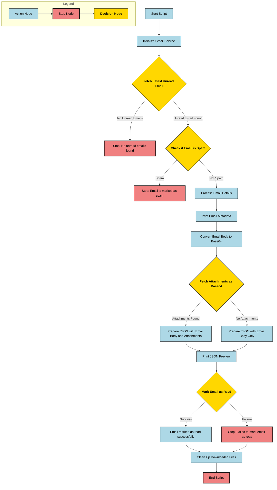

# insurerassist Email Parser Component

```mermaid
flowchart TD
    %% Legend for better understanding
    subgraph Legend [Legend]
    direction LR
    A1[Action Node]:::action --> S1[Stop Node]:::stop --> D1[Decision Node]:::decision
    end

    classDef action fill:#ADD8E6,stroke:#000,stroke-width:1px,color:#000;
    classDef stop fill:#F08080,stroke:#000,stroke-width:2px,color:#000;
    classDef decision fill:#FFD700,stroke:#000,stroke-width:1px,color:#000,font-weight:bold;

    %% Actual process flow
    Start["Start Script"]:::action --> B[Initialize Gmail Service]:::action
    B --> C{Fetch Latest Unread Email}:::decision

    C -->|No Unread Emails| D[Stop: No unread emails found]:::stop
    C -->|Unread Email Found| E{Check if Email is Spam}:::decision

    E -->|Spam| F[Stop: Email is marked as spam]:::stop
    E -->|Not Spam| G[Process Email Details]:::action

    G --> H[Print Email Metadata]:::action
    H --> I[Convert Email Body to Base64]:::action
    I --> J{Fetch Attachments as Base64}:::decision

    J -->|Attachments Found| K[Prepare JSON with Email Body and Attachments]:::action
    J -->|No Attachments| L[Prepare JSON with Email Body Only]:::action

    K --> M[Print JSON Preview]:::action
    L --> M

    M --> N{Mark Email as Read}:::decision
    N -->|Success| O[Email marked as read successfully]:::action
    N -->|Failure| P[Stop: Failed to mark email as read]:::stop

    O --> Q[Clean Up Downloaded Files]:::action
    P --> Q
    Q --> R["End Script"]:::stop

```
