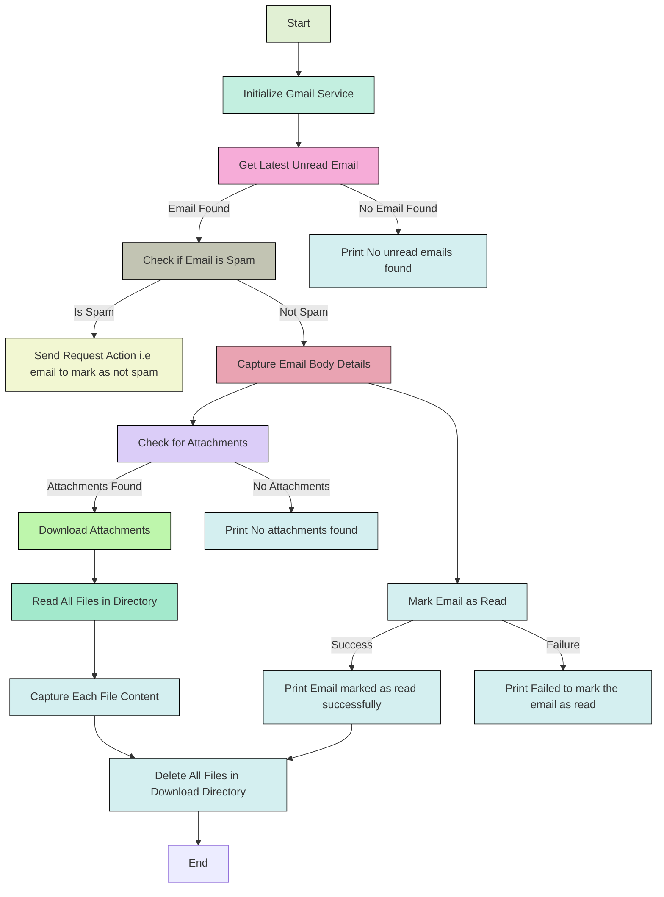

# insurerassist Email Parser Component

```mermaid
graph TD
    A[Start] --> B[Initialize Gmail Service]
    B --> C[Get Latest Unread Email]
    C -->|Email Found| D[Check if Email is Spam]
    C -->|No Email Found| E[Print No unread emails found]

    D -->|Is Spam| F[Send Request Action i.e email to mark as not spam]
    D -->|Not Spam| G[Capture Email Body Details]
    
    G --> H[Check for Attachments]
    H -->|Attachments Found| I[Download Attachments]
    I --> J[Read All Files in Directory]
    H -->|No Attachments| K[Print No attachments found]
    
    J --> L[Capture Each File Content]
    G --> M[Mark Email as Read]
    M -->|Success| N[Print Email marked as read successfully]
    M -->|Failure| O[Print Failed to mark the email as read]

    N --> P[Delete All Files in Download Directory]
    L --> P
    P --> Q[End]

  style A stroke:#000000,fill:#E1F0D4 
  style B stroke:#000000,fill:#C3EFE0 
  style C stroke:#000000,fill:#F6ACD8
  style D stroke:#000000,fill:#C2C4B3 
  style E stroke:#000000,fill:#D4EFF0
  style F stroke:#000000,fill:#F2F7D2 
  style G stroke:#000000,fill:#E9A3B2 
  style H stroke:#000000,fill:#DBCDF8 
  style I stroke:#000000,fill:#BEF6AC 
  style J stroke:#000000,fill:#A3E9CC 
  style K stroke:#000000,fill:#D4EFF0
  style L stroke:#000000,fill:#D4EFF0
  style M stroke:#000000,fill:#D4EFF0
  style N stroke:#000000,fill:#D4EFF0
  style O stroke:#000000,fill:#D4EFF0
  style P stroke:#000000,fill:#D4EFF0

```
