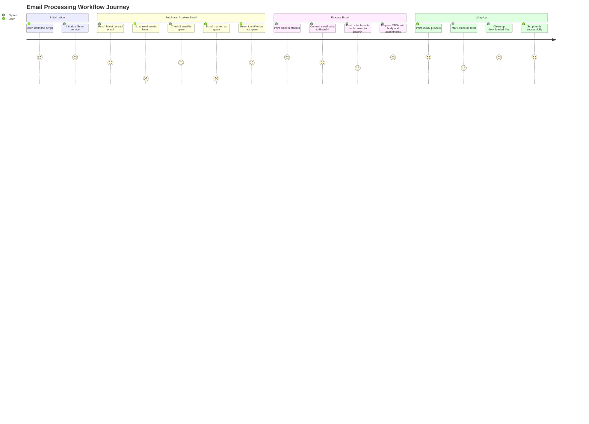

# zUser Journey Email Parser Component

```mermaid
journey
    title Email Processing Workflow Journey
    section Initialization
      User starts the script: 5:User
      Initialize Gmail service: 5:System
    section Fetch and Analyze Email
      Fetch latest unread email: 4:System
      No unread emails found: 1:User
      Check if email is spam: 4:System
      Email marked as spam: 1:User
      Email identified as not spam: 4:User
    section Process Email
      Print email metadata: 5:System
      Convert email body to Base64: 4:System
      Fetch attachments and convert to Base64: 3:System
      Prepare JSON with body and attachments: 5:System
    section Wrap-Up
      Print JSON preview: 5:User
      Mark email as read: 3:System
      Clean up downloaded files: 5:System
      Script ends successfully: 5:User

```
